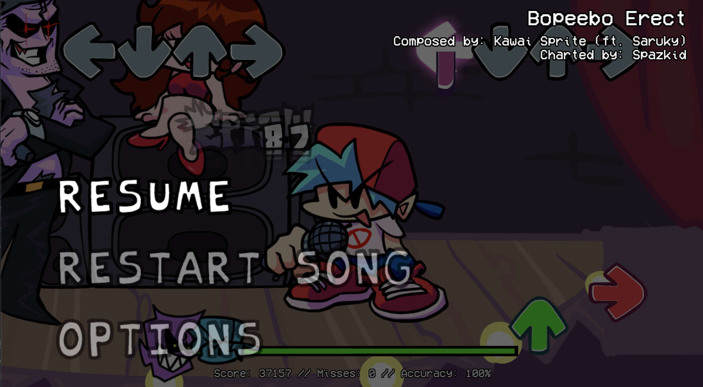

# EvilCokeEngine
That one my cancelled engine "COKE Engine" but fucking fucking EVIL!!!!!!

**THIS ENGINE IN HEAVLY WORK IN PROGRESS!! Most of the gameplay is complete, but the UI is still largely unfinished.**

## Features
### Cool FPS Counter (Absolutely not based on the Codename Engine trust me pls)


### Modernized Options Screen


### Fancy Pause Screen


### Almost all the gameplay customization you need is included!
downscroll, middlescroll, scroll speed multiplier....


### Object-oriented Lua Scripting ~~(so its better than Psych Engine)~~
Most of the characters, some stages, events etc are loaded using lua.


### Godot hardcode support rivals semi-Softcoded luas


### A fully layered sandbox system to aid in mod development


### Others
- Full-fledged modchart functions
    - Based on **FNF In The Galaxy** and **Andromeda Engine** (+ Schmoovin)
    ```lua
    modchart:set_percent("drunk", 100 , -1) -- you can do this thing and something lol check scenes/nodes/modchart folder on source
    ```
- Highly optimized note rendering with implemented cue system and tiled sustained notes
- A pretty decent input system based from original research from Vanilla, FPS Plus, Psych, and Osu!Mania
- ~~Overly~~ organized character debugger etc...

## Special Thanks
- Forever Engine
    - Note Splashes (i don't support shubs!!!!!)
- cherry
    - made godot_sparrow and gdanimate addons.
- gilzoide
    - made lua-gdextension addon.
- vaporvee
    - made discord-rpc-godot addon.